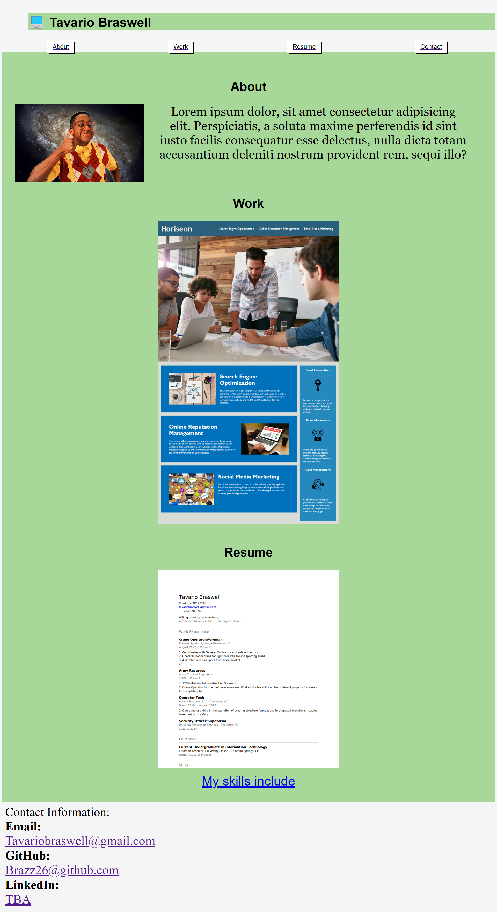
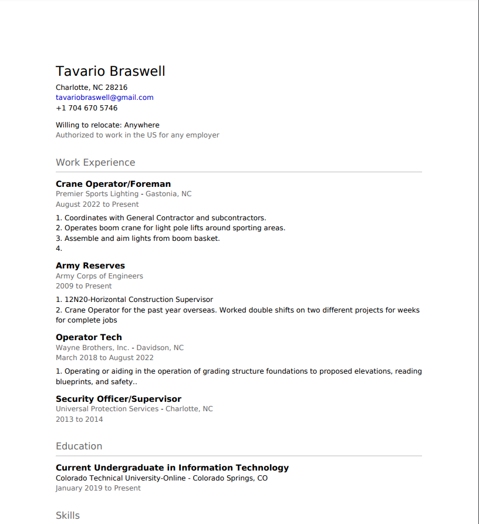

The purpose of this portfolio is to give an example of previous work to a potential employer.
I've learned many CSS properties and continue to learn more daily.
Inside of this README the reader will find a live link, several pictures of live website, and github url.

